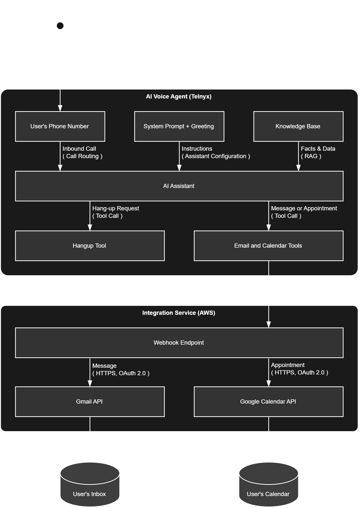

# Gem

  

 

Gem is an AI telephone assistant: an intelligent answering machine that the user connects to their phone number. When a call comes in that the user cannot take, Gem answers it, finds out who is calling and why, helps with simple requests using what the user has told it, and otherwise takes a clear message or books an appointment. The user receives the message by email, and any appointment appears in their calendar.

Gem runs as a [Telnyx AI Assistant](https://telnyx.com/products/ai-assistants). Telnyx provides the telephony, speech recognition, language model, and speech synthesis; Gem's own integration service connects the assistant to the user's email and calendar.

The name is inspired by the character Gem in the film *Tron: Legacy*. Gem is under development and the current build is a single-user MVP, and [What Gem Does Today](#-what-gem-does-today) shows the current status.

## ✨ What Gem Does Today

| Capability | Status |
|------------|--------|
| Answer inbound calls with a spoken greeting and identify the caller | Live |
| Answer simple questions from a built-in knowledge section (availability, contact details) | Live |
| Take a structured message: caller name, callback number, reason, time sensitivity | Live |
| Close the call cleanly and hang up | Live |
| Email the message to Rohin (Gmail) | Planned |
| Book appointments in Rohin's Google Calendar | Planned |
| Serve knowledge from a Telnyx Knowledge Base instead of the system prompt | Planned |
| Migrate from Cloudflare to AWS | Planned |

Gem cannot transfer calls or look up private data; when a request is outside its abilities it offers to take a message instead.

## 🔧 How It Works

**Connect a number.** The user connects Gem to their phone number through Telnyx. From then on, callers who reach that number are answered by Gem.

**Tell Gem what it needs to know.** Gem's behaviour comes from a system prompt, voice rules, how to take a message, how to end a call, and a Knowledge Base holding what the user wants Gem to know: who the user is, when they are usually available, how to pronounce their name, and the answers to the questions callers most often ask. Gem uses only these facts; it never invents information, calendar entries, or transfers.

**Handle the call.** Gem greets the caller and, one short question at a time, works out what they need. Simple questions it answers from the Knowledge Base. Anything else becomes a message, caller name, callback number, reason, and how urgent it is, read back once for confirmation. If the caller wants to meet, Gem checks the user's calendar and agrees a time. Telnyx injects live context into every call: the channel, the current time in the user's time zone, and the caller's number.

**Deliver the outcome.** Every action Gem takes is a Telnyx tool backed by the integration service: a taken message is emailed to the user, and an agreed time becomes an event in the user's calendar. When the request is handled, Gem closes the call.

